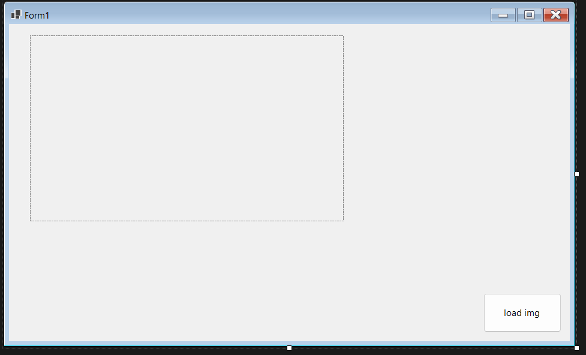

# Image Process

## 1- Load Image

---


```vbnet
Public Class Form1
    Public loadimg As New OpenFileDialog
    Private Sub Button1_Click(sender As Object, e As EventArgs) Handles Button1.Click
        If loadimg.ShowDialog() = Windows.Forms.DialogResult.OK Then
            PictureBox1.Load(loadimg.FileName)
        End If
    End Sub
End Class

```

---

## 2- convert to binary and gray image

---


``` vbnet
Public Class Form1
    Public load_img As New OpenFileDialog
    Public x As Integer, y As Integer, i As Integer, j As Integer

    Private Sub binary_gray_img_Click(sender As Object, e As EventArgs) Handles binary_gray_img.Click

        Dim pixel As New Color
        Dim img1 As New Bitmap(PictureBox1.Image)
        Dim gray_img As New Bitmap(PictureBox1.Width, PictureBox1.Height)
        Dim bin_img As New Bitmap(PictureBox1.Width, PictureBox1.Height)

        For Me.i = 0 To x - 1
            For Me.j = 0 To y - 1
                pixel = img1.GetPixel(i, j)
                r = pixel.R : g = pixel.G : b = pixel.B

                p = (r + g + b) / 3

                gray_img.SetPixel(i, j, Color.FromArgb(p, p, p))

                If p < 128 Then
                    bin_img.SetPixel(i, j, Color.FromArgb(0, 0, 0))
                Else
                    bin_img.SetPixel(i, j, Color.FromArgb(255, 255, 255))

                End If
            Next
        Next

        PictureBox2.Image = gray_img
        PictureBox3.Image = bin_img
    End Sub

    Public r As Integer, g As Integer, b As Integer, p As Integer


    Private Sub load_img1_Click(sender As Object, e As EventArgs) Handles load_img1.Click
        If load_img.ShowDialog() = Windows.Forms.DialogResult.OK Then
            PictureBox1.Load(load_img.FileName)

        End If
        x = PictureBox1.Width
        y = PictureBox1.Height

    End Sub
End Class

```

---

## 3- Load Image and get information color RGB

---


``` vbnet
Public Class Form1
    Public loadimg As New OpenFileDialog
    Public x As Integer, y As Integer, i As Integer, j As Integer
    Public r As Integer, g As Integer, b As Integer
    Private Sub Button2_Click(sender As Object, e As EventArgs) Handles Button2.Click
        Dim pixel As New Color
        Dim img1 As New Bitmap(PictureBox1.Image)

        For Me.i = 0 To x - 1
            For Me.j = 0 To y - 1
                pixel = img1.GetPixel(i, j)
                r = pixel.R : g = pixel.G : b = pixel.B

                TextBox1.SelectedText = "R = " & Str(r) & " G = " & Str(g) & " B = " & Str(b) & vbCrLf
            Next
        Next

    End Sub

    Private Sub Button1_Click(sender As Object, e As EventArgs) Handles Button1.Click
        If loadimg.ShowDialog() = Windows.Forms.DialogResult.OK Then
            PictureBox1.Load(loadimg.FileName)
        End If
        x = PictureBox1.Width
        y = PictureBox1.Height
    End Sub
End Class


```

---

## 4- Arithmetic and Logical Operations on Images

---


``` vbnet
Public Class Form1
    Public loadimg1 As New OpenFileDialog
    Public loadimg2 As New OpenFileDialog
    Public x1 As Integer, y1 As Integer, i As Integer, j As Integer
    Public x2 As Integer, y2 As Integer
    Public x As Integer, y As Integer
    Public r1 As Integer, g1 As Integer, b1 As Integer
    Public r2 As Integer, g2 As Integer, b2 As Integer
    Public r3 As Integer, g3 As Integer, b3 As Integer

    Private Sub add1_Click(sender As Object, e As EventArgs) Handles add1.Click
        Dim pixel1 As New Color
        Dim img1 As New Bitmap(PictureBox1.Image)

        Dim pixel2 As New Color
        Dim img2 As New Bitmap(PictureBox2.Image)

        Dim img3 As New Bitmap(x, y)

        For Me.i = 0 To x - 1
            For Me.j = 0 To y - 1
                pixel1 = img1.GetPixel(i, j)
                pixel2 = img2.GetPixel(i, j)

                r1 = pixel1.R
                g1 = pixel1.G
                b1 = pixel1.B

                r2 = pixel2.R
                g2 = pixel2.G
                b2 = pixel2.B
                r3 = (r1 + r2) / 2
                g3 = (g1 + g2) / 2
                b3 = (b1 + b2) / 2

                If r3 > 255 Then r3 = 255
                If g3 > 255 Then g3 = 255
                If b3 > 255 Then b3 = 255


                img3.SetPixel(i, j, Color.FromArgb(r3, g3, b3))


            Next
        Next

        PictureBox3.Image = img3
    End Sub

    Private Sub sub1_Click(sender As Object, e As EventArgs) Handles sub1.Click
        Dim pixel1 As New Color
        Dim img1 As New Bitmap(PictureBox1.Image)

        Dim pixel2 As New Color
        Dim img2 As New Bitmap(PictureBox2.Image)

        Dim img3 As New Bitmap(x, y)

        For Me.i = 0 To x - 1
            For Me.j = 0 To y - 1
                pixel1 = img1.GetPixel(i, j)
                pixel2 = img2.GetPixel(i, j)

                r1 = pixel1.R
                g1 = pixel1.G
                b1 = pixel1.B

                r2 = pixel2.R
                g2 = pixel2.G
                b2 = pixel2.B
                r3 = (r1 - r2) / 2
                g3 = (g1 - g2) / 2
                b3 = (b1 - b2) / 2

                If r3 < 0 Then r3 = 0
                If g3 < 0 Then g3 = 0
                If b3 < 0 Then b3 = 0


                img3.SetPixel(i, j, Color.FromArgb(r3, g3, b3))


            Next
        Next

        PictureBox3.Image = img3
    End Sub

    Private Sub mul1_Click(sender As Object, e As EventArgs) Handles mul1.Click
        Dim pixel As New Color
        Dim img1 As New Bitmap(PictureBox1.Image)
        Dim mul_img As New Bitmap(PictureBox1.Width, PictureBox1.Height)

        For Me.i = 0 To x1 - 1
            For Me.j = 0 To y1 - 1
                pixel = img1.GetPixel(i, j)
                r1 = pixel.R : g1 = pixel.G : b1 = pixel.B

                r2 = r1 * Val(TextBox1.Text)
                If r2 > 255 Then r2 = 255

                g2 = g1 * Val(TextBox1.Text)
                If g2 > 255 Then g2 = 255

                b2 = b1 * Val(TextBox1.Text)
                If b2 > 255 Then b2 = 255


                mul_img.SetPixel(i, j, Color.FromArgb(r2, g2, b2))


            Next
        Next

        PictureBox2.Image = mul_img
    End Sub

    Private Sub div1_Click(sender As Object, e As EventArgs) Handles div1.Click
        Dim pixel As New Color
        Dim img1 As New Bitmap(PictureBox1.Image)
        Dim div_img As New Bitmap(PictureBox1.Width, PictureBox1.Height)

        For Me.i = 0 To x1 - 1
            For Me.j = 0 To y1 - 1
                pixel = img1.GetPixel(i, j)
                r1 = pixel.R : g1 = pixel.G : b1 = pixel.B

                r2 = r1 / Val(TextBox2.Text)
                If r2 < 0 Then r2 = 0

                g2 = g1 / Val(TextBox2.Text)
                If g2 < 0 Then g2 = 0

                b2 = b1 / Val(TextBox2.Text)
                If b2 < 0 Then b2 = 0


                div_img.SetPixel(i, j, Color.FromArgb(r2, g2, b2))


            Next
        Next

        PictureBox3.Image = div_img
    End Sub

    Private Sub and1_Click(sender As Object, e As EventArgs) Handles and1.Click
        Dim pixel1 As New Color
        Dim img1 As New Bitmap(PictureBox1.Image)

        Dim pixel2 As New Color
        Dim img2 As New Bitmap(PictureBox2.Image)

        Dim img3 As New Bitmap(x, y)

        For Me.i = 0 To x - 1
            For Me.j = 0 To y - 1
                pixel1 = img1.GetPixel(i, j)
                pixel2 = img2.GetPixel(i, j)

                r1 = pixel1.R
                g1 = pixel1.G
                b1 = pixel1.B

                r2 = pixel2.R
                g2 = pixel2.G
                b2 = pixel2.B
                r3 = (r1 And r2)
                g3 = (g1 And g2)
                b3 = (b1 And b2)

                If r3 > 255 Then r3 = 255
                If g3 > 255 Then g3 = 255
                If b3 > 255 Then b3 = 255


                img3.SetPixel(i, j, Color.FromArgb(r3, g3, b3))


            Next
        Next

        PictureBox3.Image = img3
    End Sub

    Private Sub or1_Click(sender As Object, e As EventArgs) Handles or1.Click
        Dim pixel1 As New Color
        Dim img1 As New Bitmap(PictureBox1.Image)

        Dim pixel2 As New Color
        Dim img2 As New Bitmap(PictureBox2.Image)

        Dim img3 As New Bitmap(x, y)

        For Me.i = 0 To x - 1
            For Me.j = 0 To y - 1
                pixel1 = img1.GetPixel(i, j)
                pixel2 = img2.GetPixel(i, j)

                r1 = pixel1.R
                g1 = pixel1.G
                b1 = pixel1.B

                r2 = pixel2.R
                g2 = pixel2.G
                b2 = pixel2.B
                r3 = (r1 Or r2)
                g3 = (g1 Or g2)
                b3 = (b1 Or b2)

                If r3 < 0 Then r3 = 0
                If g3 < 0 Then g3 = 0
                If b3 < 0 Then b3 = 0


                img3.SetPixel(i, j, Color.FromArgb(r3, g3, b3))


            Next
        Next

        PictureBox3.Image = img3
    End Sub


    Private Sub load_img2_Click(sender As Object, e As EventArgs) Handles load_img2.Click
        If loadimg2.ShowDialog() = Windows.Forms.DialogResult.OK Then
            PictureBox2.Load(loadimg2.FileName)

        End If
        x2 = PictureBox2.Width
        y2 = PictureBox2.Height

        x = Math.Min(x1, x2)
        y = Math.Min(y1, y2)
    End Sub

    Private Sub load_img1_Click(sender As Object, e As EventArgs) Handles load_img1.Click
        If loadimg1.ShowDialog() = Windows.Forms.DialogResult.OK Then
            PictureBox1.Load(loadimg1.FileName)

        End If
        x1 = PictureBox1.Width
        y1 = PictureBox1.Height

    End Sub
End Class

```

---

## 5- Histogram shrink stretch

---


``` vbnet
Public Class Form1

    Public load_img As New OpenFileDialog
    Public x As Integer, y As Integer, i As Integer, j As Integer
    Public r As Integer, g As Integer, b As Integer

    Private Sub Button3_Click(sender As Object, e As EventArgs) Handles Button3.Click
        'Code stretch
        Dim img As New Bitmap(PictureBox1.Image)
        Dim img_str As New Bitmap(x, y)
        Dim pixel1 As New Color, r As Integer, maxlev As Integer, minlev As Integer

        minlev = 255
        maxlev = 0


        For Me.i = 0 To x - 1
            For Me.j = 0 To y - 1
                pixel1 = img.GetPixel(i, j)
                r = pixel1.R

                If r > maxlev Then maxlev = r
                If r < minlev Then minlev = r

            Next
        Next


        For Me.i = 0 To x - 1
            For Me.j = 0 To y - 1
                pixel1 = img.GetPixel(i, j)
                r = pixel1.R
                r = ((r - minlev) / (maxlev - minlev)) * (255 - 0) + 0


                If r < 0 Then
                    r = 0
                End If
                If r > 255 Then
                    r = 255
                End If

                img_str.SetPixel(i, j, Color.FromArgb(r, r, r))
            Next
        Next
        PictureBox2.Image = img_str
    End Sub

    Private Sub Button4_Click(sender As Object, e As EventArgs) Handles Button4.Click
        ' Code shrink
        Dim img As New Bitmap(PictureBox1.Image)
        Dim img_str As New Bitmap(x, y)
        Dim pixel1 As New Color, r As Integer, maxlev As Integer, minlev As Integer

        minlev = 255
        maxlev = 0


        For Me.i = 0 To x - 1
            For Me.j = 0 To y - 1
                pixel1 = img.GetPixel(i, j)
                r = pixel1.R

                If r > maxlev Then maxlev = r
                If r < minlev Then minlev = r

            Next
        Next


        For Me.i = 0 To x - 1
            For Me.j = 0 To y - 1
                pixel1 = img.GetPixel(i, j)
                r = pixel1.R
                r = ((80 - 40) / (maxlev - minlev)) * (r - minlev) + 40


                If r < 0 Then
                    r = 0
                End If
                If r > 255 Then
                    r = 255
                End If

                img_str.SetPixel(i, j, Color.FromArgb(r, r, r))
            Next
        Next
        PictureBox2.Image = img_str
    End Sub


    Private Sub Button2_Click(sender As Object, e As EventArgs) Handles Button2.Click
        'Code Histogram
        Dim hist_img As New Bitmap(PictureBox1.Image)
        Dim pixel1 As New Color
        Dim histo_r(256) As Integer, histo_g(256) As Integer, histo_b(256) As Integer

        For Me.i = 0 To x - 1
            For Me.j = 0 To y - 1
                pixel1 = hist_img.GetPixel(i, j)
                r = pixel1.R : g = pixel1.G : b = pixel1.B
                histo_r(r) += 1
                histo_g(g) += 1
                histo_b(b) += 1

            Next
        Next

        For Me.i = 0 To 255
            TextBox1.SelectedText = " histo r = " & " ( " & Str(i) & " ) : " & Str(histo_r(i)) & vbCrLf & " histo g = " & " ( " & Str(i) & " ) : " & Str(histo_g(i)) & vbCrLf & " histo b = " & " ( " & Str(i) & " ) : " & Str(histo_b(i)) & vbCrLf & "========================" & vbCrLf


        Next


    End Sub

    Private Sub Button1_Click(sender As Object, e As EventArgs) Handles Button1.Click
        'Code Load Image
        If load_img.ShowDialog() = Windows.Forms.DialogResult.OK Then
            PictureBox1.Load(load_img.FileName)

        End If
        x = PictureBox1.Width
        y = PictureBox1.Height
    End Sub
End Class

```

---
